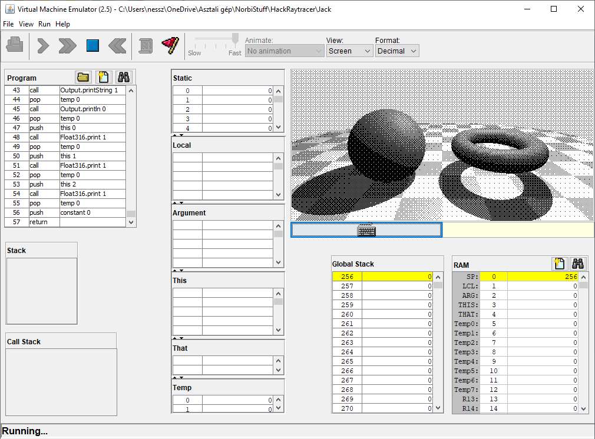
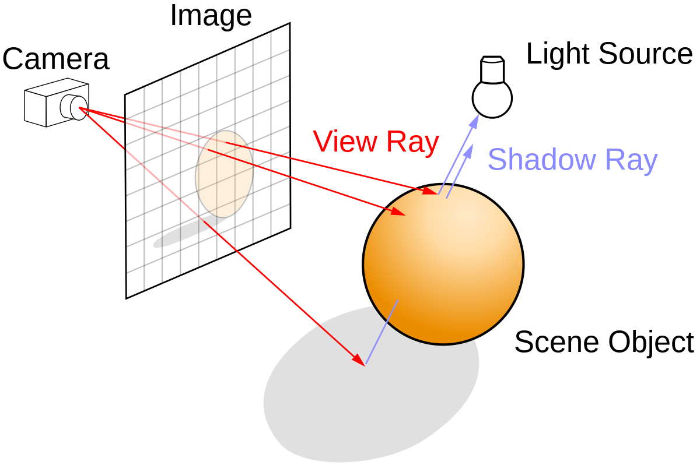
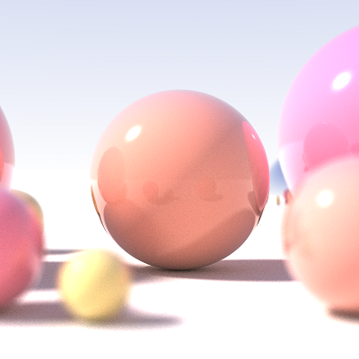
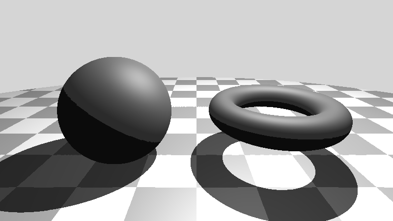
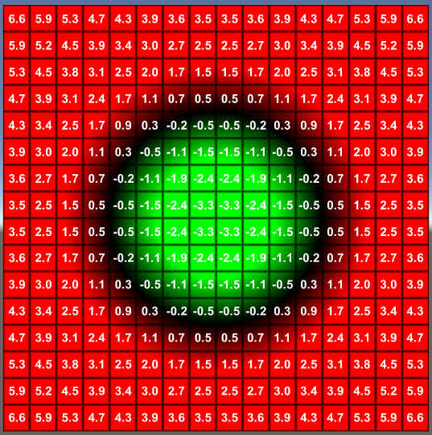
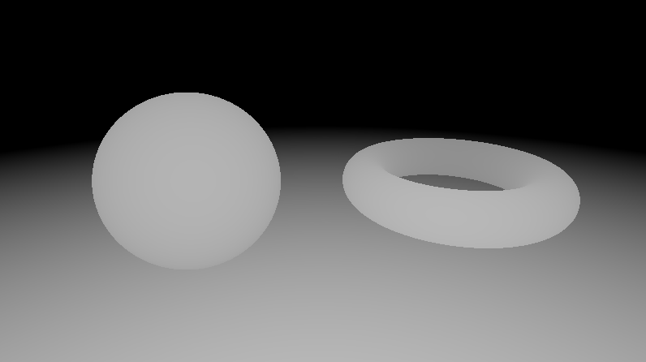
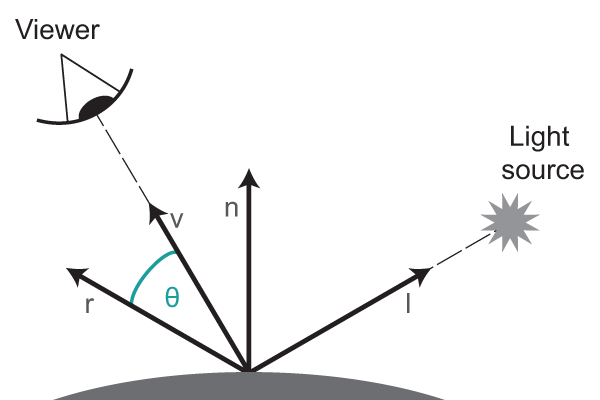
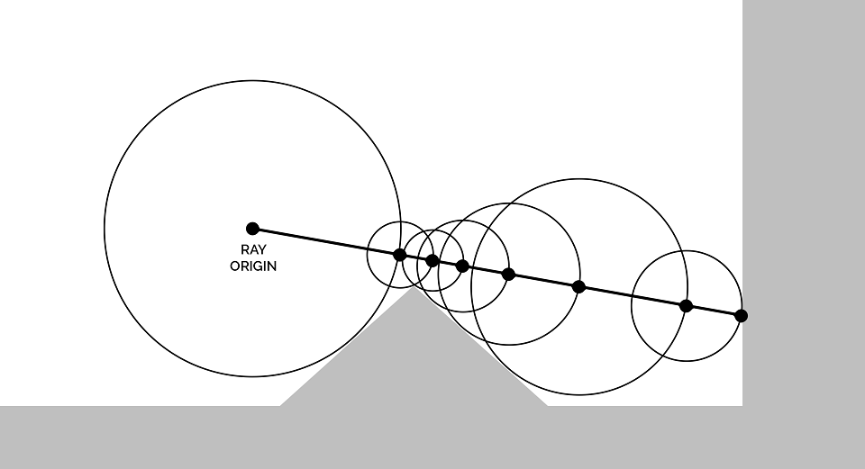
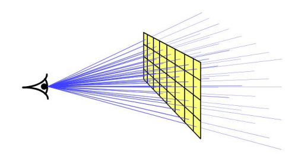

# Raymarching in Jack Language



## How to run the application

### The Jack code

1. Donwload the essential materials from [https://www.nand2tetris.org/software](https://www.nand2tetris.org/software).
2. Using the provided JackCompiler, compile the `Jack` folder of this project (for each .jack file it will generate the corresponding .vm file).
3. Using the provided VMEmulator, load the Jack folder (now containing the .vm files).
4. Don't forget to set the "Animation" to "No animate", and set the speed marker slide to "Fast".
5. Wait about 10 hours for the image to appear. :-) You should see it building pixel-by-pixel.

### The Python code (with custom Float316 type)

1. Make sure you can run Python3 with opencv-python and numpy packages.
2. Go to the `Python_Float316` folder and run `Main.py`.
3. Wait about 2 minutes for the image to appear. You should see it building row-by-row.
4. This image is pixel-equivalent to the Jack image.

### The Python code (with built-in float type)

1. Make sure you can run Python3 with opencv-python and numpy packages.
2. Go to the `Python_float` folder and run `raymarcher.py`.
3. Wait about 10 seconds for the image to appear. You should see it building row-by-row.
4. This image is slightly different to the previous images to the precision difference in float numbers.

## Table of contents

TODO

## Introduction

The online course [From Nand to Tetris](https://www.nand2tetris.org/) is an excellent lecture about building a general-purpose computer system from the most basic building components: [NAND gates](https://en.wikipedia.org/wiki/NAND_gate). It is based on the book *The Elements of Computing Systems: Building a Modern Computer from First Principles* created by the same authors, and has two major parts. Part 1 is all about the hardware they call the Hack Machine; while Part 2 goes even further: it shows how to build a two-pass compiler, where the course introduces a high-level general-purpose, object-oriented(-ish) language called the Jack language.

Though the focus of the lectures of Part 2 is building the compiler and a simplified operating system, one of the homework assignments they give you is to develop an application of your choice in Jack. This is the result of my efforts to build a raymarcher.

[Raymarching](https://en.wikipedia.org/wiki/Ray_marching) is a class of 3D rendering methods. It fells into the cathegory of [raytracing](https://en.wikipedia.org/wiki/Ray_tracing_(graphics)), a family of such methods where light rays are virtually traced through a scene to determine the color of a pixel on the screen.



*Raytracing illustrated. Source: Wikipedia*

With raytracing you can create cool looking images with different effects such as reflections, shadows, transparency, depth of field, etc. While it is not the only technique, it is essential in many areas of computer graphics and animation.



*A raytraced image with different lighting effects. Source: Wikipedia*

Though a simple raymarcher/raytracer can be done in a few dozens lines of code in most commercial programming languages, in Jack it is a quite difficult task due to the constraints of the language. But it is surely not impossible![^1]

[^1]: It is worth mentioning that this is not the first raytracing program in Jack. **Alex Quach already created such a program** (go check it out [here!](https://blog.alexqua.ch/posts/from-nand-to-raytracer/)). However, I only noticed this after I already decided I wanted to do my own raytracer. To minimize the temptation of stealing ideas, I didn't read Alex's blog during my work - but **knowing it is possible** kept me motivated the entire time. And I'm glad that in the end our solutions turned out to be so different! :-)

## Challenges in Jack/Hack

Since you create the entire hardware, the compiler, and the operating system on your own under the guidence of the nand2tetris course, understandably, there are a lot of simplifications on the underlying architecture and functionality. **Creating the Jack language** is easier, but **creating an application in Jack** is more difficult due to the same limitations.

In terms of creating a raymarching/raytracing software, these are the biggest challanges:

- **Integer-only arithmetic.** The only supported types are `int`, `char`, `boolean`, and references to strings, arrays, and custom objects. Furthermore, between integers the only operands are addition, subtraction, negation, bitwise `not`, bitwise `and`, and bitwise `or`.
- **No bit shifts.** There is no direct way to bit-shift the content of a register to left or right.
- **Hack is a [16-bit machine](https://en.wikipedia.org/wiki/16-bit_computing)** in every sense. Every register is a 16-bit register. Integers are signed integers, so we only have a range of numbers between $-32{,}768$ and $32{,}767$.
- **No overflow/underflow detection.**
- **Binary screen.** Every pixel is either completely black or completely white. We don't even have grayscale!

However, Jack has a few features that comes in handy, such as class/object definition; references to objects; static (class level), field (object level) and local variables; function calls; branching and looping; and a few more. Integer multiplication, integer division and integer square root are supported by the operating system and implemented on software side.

The screen of the Hack machine (and thus what is supported by the provided operating system) is $256 \times 512$. While the resolution is acceptable, we have no way to use colors or even grayscale images. But there is a solution called [dither](https://en.wikipedia.org/wiki/Dither) which allows us to mimic a grayscale image using only binary colors.

## Key Implementation Steps

In order to write a raytracing/raymarching program, I marked the following key steps:

1. **(Re)invent the float data type.** My solution is based on the [IEEE Standard for Floating-Point Arithmetic](https://en.wikipedia.org/wiki/IEEE_754), but differs slightly, since IEEE 754 uses 32 bits, and I only have 16.
2. **Implement the necessary float functions.** Addition, substraction, multiplication, division, square root, inverse square root, and a few more.
3. **Implement a vector type of 3 elements** and some related functions: addition, dot product, cross product, etc.
4. **Design a signed distance function.** This encodes our scene with the objects (floor, sphere, torus), but also helps with the surface normal calculations.
5. **Create the actual raymarcher** to detect which object our light ray hit at what point.
6. **Use the Phong reflection model** to calculate the ambient, diffuse and specular components of the object - this is the color (or rather, shade) of our pixel!
7. **Cast a shadow ray** using the same raymarching algorithm to determine if the pixel is in a shadow of another object.
8. **Use dithering** to determine whenever the final pixel is black or white. I used [ordered dithering](https://en.wikipedia.org/wiki/Ordered_dithering) for its simplicity but still elegant look.

Since debugging and overall developing a software in Jack can be quite difficult, I created the program in phases in different programming languages.

The first version was created with Shadertoy, an online tool for creating vertex shader applications in webGL. It is so fast you can create [raytraced animations](https://www.shadertoy.com/view/dtSyDz)!



*The grayscale prototype image created with Shadertoy*

The second version was a quick Python implementation of the very same Shadertoy program. It does the same, except it goes pixel-by-pixel on the CPU, so the render time is much slower (around 10s on my computer), but still quick enough for developing purposes.

The third version took the longest: developing such a Python program that is as close to the desired Jack implementation as possible. 16 bit integers, custom float type, binary image - the whole package. This way I was able to test the various functions easily, and once the program was done, the Jack implementation and testing became pretty straightforward.

So, let's see the gory details!

## My Custom `Float316` Type

There are basically two ways to represent real numbers: in fixed point notation, there are a fixed number of digits after the decimal point, whereas floating point number allows for a varying number of digits after the decimal point. Both has its advantages and disadvantages, so after some consideration, I went with floating points.

[IEEE 754](https://en.wikipedia.org/wiki/IEEE_754) is one of the best known representation of such numbers. It uses 32 bits to encode 3 parts: a sign (1 bit), a mantissa (8 bits), and an exponent (23 bits) in this order.


The sign is a single bit: $s=0$ means the number is positive, $s=1$ means it's negative.

The exponent can be interpreted as an unsigned integer - and to avoid negative numbers, they add a constant of $127$ to it. So, while `01111100` is $124$ in decimal, it actually means an exponent of $e = -3$.

The mantissa includes 23 fraction bits to the right of the binary point and an implicit leading bit. The first bit indicates whenever we have $\frac{1}{2}$, the second bit is for $\frac{1}{4}$, then $\frac{1}{8}$, $\frac{1}{16}$, and so on. A mantissa of `010110...` can be interpreted as $m = \frac{1}{4} + \frac{1}{16} + \frac{1}{32} + \dots$

An IEEE 754 bitstring encodes the following real number:

$$(-1)^{s} \cdot (1+m) \cdot 2^e$$

In the example image above, $s=1$, $e=3$ (stored as $124$ in binary), $m=\frac{1}{4} = 0.25$, so the number is $(1+0.25) \cdot 2^{-3} = 0.15625$.

Just to make sure you understand IEEE 754 numbers, let's see another example! Take this bitstring of 32 bits:

`11000001010110000000000000000000`

Let's break this into its parts:

`1 | 10000010 | 10110000000000000000000`

With these settings, $s=1$, $e=130 - 127 = 3$, and $m = \frac{1}{2} + \frac{1}{8} + \frac{1}{16}  = 0.6875.$ So, the real number is: $-(1+0.6875) \cdot 2^3 = -13.5$.

This allows us to represent a wide range of numbers, from very small to quite large ones. Keep in mind that there are infinitely many real numbers even between $0$ and $1$, so we cannot represent all of them exactly. For example, $0.1$ is actually $0.100000001490116119384765625$ if we decode the bits (which are by the way `0 | 01111011 | 10011001100110011001101`). But for our case (and for many other real world applications), this is good enough!


IEEE 754 is a good idea for Jack, but it requires 32 bits. We only have 16. There is a so called [Half-precision floating-point format](https://en.wikipedia.org/wiki/Half-precision_floating-point_format), which uses the same idea, but with 16 bits: a sign (1 bit), an exponent (5 bits), and a mantissa (10 bits). We lose some precision, but it can be still good for us, right?

The problem is that certain operations such as multiplication requires twice as many bits for the mantissa. So, even for the half-precision floating-point, that would be 20 bits, which we cannot use. So we have to do some extra tricks to make the multiplication work (see later) and break it into smaller parts. This also implies that we don't have to restrict ourselves to 10 bits: the mantissa can be stored separately in a Jack integer, with 16 bits.

As we will see later, we need overflow detection, and we also have to store the "hidden 1" of IEEE 754 (the explicit bit), because we don't want to use the extra computation to deal with it constantly. We want our number to represent $m \cdot 2^e$, not $(1+m) \cdot 2^e$. So, in our implementation of the float type, the mantissa bit string always begins with `001`, and the rest of the 13 bits are the actual values we care about. We handle the exponent and the sign the same was as IEEE 754 does, but again, we store them as separate integers.

Hence the birth of the `Float316` type (I chose the subfix `316`, because it requires "three 16-bit integers").

Let's say we want to represent the number $-25.75$. You can use this [handy tool](https://www.h-schmidt.net/FloatConverter/IEEE754.html) to see what the IEEE 754 representation is of that number:

`1 | 10000011 | 10011100000000000000000`

In `Float316`, we keep the sign as `1` and the exponent as `10000011`. For the mantissa, we left-pad the it with `001` (two overflow-detector bits and the "hidden 1"), and keep the first 16 bits.

Our `Float316` representation of $-25.75$:

`1 | 10000011 | 0011001110000000`

Or in decimal from:

`1, 131, 13184`

Note that in our case of the mantissa the bit worth $\frac{1}{2}$ is on the 4th place, the bit worth $\frac{1}{4}$ is the 5th, and so on. Going the other direction, the 3rd bit can be interpreted as $1$, the 2nd bit as $2$, and the 1st bit as $4$.

### Few extra notes on `Float316`

- The real numbers $+0$ and $-1$ are special cases, and represented as `0, 0, 0` and `1, 0, 0`, respectfully.
- Other special cases such are infinities, NaNs and subnormal numbers are not supported in `Float316`. We don't need them (but one can extend the class if they want to).
- Storing a single bit sign as a 16-bit integer is quite wasteful in terms of memory, but it simplifies later calculations a lot - and for our case, that is more important than keeping the memory usage low.
- In Jack, we actually never have to decipher what floating point number we store in `Float316`. We don't have to print them, we just have to apply certain operations to them, and decide which encodes a bigger number, which one is negative, and so on. Though we have to able to hard-code a few constants. For example, the number $1.0$ is represented as `0, 127, 8192`.
- Just like in IEEE 754, integers within a certain range can be represented exactly. So, while $0.1$ is not actually $0.1$ as we've seen before, it is true that $124.0$ is always exactly $124.0$ (if you are curious, `0, 133, 15872` in `Float316`).
- The mantissa actually stores 13 bits instead of 23 comparing to IEEE 754. We lose some precision, but we are still quite good enough! In `Float316`, the next real number after $1.0$ is $1.0001220703125$.

For our raymarcher, we need the following functions on `Float316` numbers:

- Normalization
- Decide which one is bigger (the `gt()` function)
- Addition
- Subtraction
- Multiplication
- Division
- Floor function
- Modulo 2 function
- Square root function
- Inverse square root function

For more details on these individual functions, see [Appendix A](media/AppendixA.md).

## Vector Arithmetic

We need vectors of 3 float components to represent coordinates and directions. This is quite easy, so I just list all the required functions we need (you can read about them on [this wiki page](https://en.wikipedia.org/wiki/Euclidean_vector#Basic_properties)).


Let ${\bf v} = (x, y, z)$ denote a vector, and $c$ a scalar.

### Addition

${\bf v_1} + {\bf v_2} = (x_1 + x_2, ~ y_1 + y_2, ~ z_1 + z_2)$

### Substraction

${\bf v_1} - {\bf v_2} = (x_1 - x_2, ~ y_1 - y_2, ~ z_1 - z_2)$

### Scalar multiplication

Changes the length of the vector while the direction remains.

$c \cdot {\bf v} = (cx, ~ cy, ~ cz)$

### Length

Gives us the length of a vector.

$||{\bf v}|| = \sqrt{x^2 + y^2 + z^2}$

### Normalization

Changes the length of the vector to $1$ while the direction remains. The usual way is to divide the vector components by the length of the vector:

$N({\bf v}) = \large(\frac{x}{||{\bf v}||}, ~ \frac{y}{||{\bf v}||}, ~ \frac{z}{||{\bf v}||} \large)$

But we actually use the inverse square root here:

$S = \text{invSqrt}(x^2 + y^2 + z^2)$

$N({\bf v}) = (xS, ~ yS, ~ zS)$

### Dot product

It gives $||{\bf v_1}|| \cdot ||{\bf v_2}|| \cdot \theta$, where $\theta$ is the cosine of the angle between the two vectors. If the vectors are already normalized, the dot product is a simple way to measure angles!

${\bf v_1} \cdot {\bf v_2} = x_1 x_2 + y_1 y_2 + z_1 z_2$

### Cross product

It gives a new vector that is perpendicular to the other two (with respect to a right-handed coordinate system):

${\bf v_1} \times {\bf v_2} = (y_1 z_2 - y_2 z_1, ~ z_1 x_2 - z_2 x_1, ~ x_1 y_2 - x_2 y_1)$

## Signed Distance Function

Raymarching is an iterative technique to determine the intersection point of a light ray and and an object surface. To aid the raymarching algorithm, we can use $\text{SDFs}$ - signed distance functions.

The $\text{SDF}$ value of a 3D point $P = (x, y, z)$ is simply the distance of $P$ and the closest object surface. So, if $\text{SDF}(P) = 0$, it means that that particular $P$ point is on a surface. If the $\text{SDF}$ is some positive number, that means the point is outside of the object. If the value is negative, the point is inside of the object. The $\text{SDF}$ value itself does not give us any directions - we don't know *where* is the closest surface point, only *how far* it is from the given $P$ point.

Here is a 2D example of a signed distance function, where every pixel shows the $\text{SDF}$ value of its center.



*A circle with signed distances. Source: https://shaderfun.com/*

As you can imagine, different scenes have different $\text{SDFs}$. If you want cubes instead of spheres, we have to change the $\text{SDF}$ accordingly.

Luckily, $\text{SDFs}$ are very flexible. A lot of basic geometric shapes have simple $\text{SDFs}$. $\text{SDFs}$ can be combined, distorted, or altered in some way that they can create cool effects: duplicate objects without increasing the complexity, create rippled surface effects, rotate and scale objects, blending objects together in a continuous way, creating holes, and so on.

[Here](https://iquilezles.org/articles/distfunctions/) you can see a lot of $\text{SDFs}$ and how to manipulate them. For my project, I selected a simple $\text{SDF}$ that is basically the union of a plane, a sphere and a torus. But it can be modified easily to create something different!



*My signed distance function visualized. Darker pixel means bigger distance from the camera*

Note that pure $\text{SDFs}$ returns with a single distance value for a particular input position. If we find a surface point (where the $\text{SDF}$ value is $0$), we also want to identify which object did we find - because different objects have different properties. In my case, the only other property is the color (shade) of the object, so instead of a single value, my $\text{SDF}$ returns with a `Surface` object. A `Surface` contains two `Float316` numbers: one is the distance to the closest object, the other one is the color (the shade of gray normalized between $0.0$ and $1.0$), of that object. In other applications a `Surface` can contain even more information: material properties, texture coordinates, transparency level, refractive index, and so on.

## Surface Normals with $\text{SDF}$

In order to calculate the light intensity at a specific surface point, we need the normal vector: a vector that is perpendicular to the tangent plane of the surface at that point.


*A surface showing many surface normals at various surface points. Source: Wikipedia*

To quote from the [Wikipedia article](https://en.wikipedia.org/wiki/Normal_(geometry)): "If a surface $S$ is given implicitly as the set of points $(x, y, z)$ satisfying $F(x, y, z) = 0$, then a normal at a point $(x, y, z)$ on the surface is given by the gradient ${\bf n} = \nabla F(x, y, z)$".

How lucky of us - an $\text{SDF}$ is indeed such a function!

You can read more about the calculation of surface normals from $\text{SDFs}$ [here](https://iquilezles.org/articles/normalsSDF/). The basic idea is to use the $\text{SDF}$ values near a surface point with slight changes in the $(x, y, z)$ coordinates to determine the gradient, and hence after a vector normalization, the normal vector.

I used the tetrahedron technique to calculate the surface normals. It calls the $\text{SDF}$ four times for a single surface normal. I also tried the classic technique that calls the $\text{SDF}$ three times but results biased normals. I found the latter about 10% faster, but visually I was not satisfied with the result.


*Surface normals: each color shows an* $(x, y, z)$ *surface normal interpreted as normalized RGB values. For example, the floor is green because each surface normal points to the* $(0, 1, 0)$ *direction*

## The Phong Reflection Model

The [Phong Reflection Model](https://en.wikipedia.org/wiki/Phong_reflection_model) is an empirical model to create realistic looking (but still locally computed) lights. It contains three components: ambient, which represents the light scattered across all the scene; diffuse reflection of rough surfaces; and specular reflection, which acts like the mirror-like reflection of the light sources on the surface.


*The Phong Reflection Model. Source: Wikipedia*

All of the components can be computed at a given $P$ surface point fairly easily if the surface normal and a few other parameters are known.

For simplicity, we consider only one light source. In that case:

$\text{ambient} = k_a i_a$

$\text{diffuse }= k_d i_d ({\bf L} \cdot {\bf N})$

$\text{specular} = k_s i_s ({\bf R} \cdot {\bf V})^{\alpha}$

Here, $k_a$, $k_d$ and $k_s$ are the ambient, diffuse and specular reflection constants of the material (we can think of as the color of the object), $i_a$, $i_d$ and $i_s$ are the ambient, diffuse and specular components of the light (sort-of the color of the light). ${\bf L}$ is the normalized direction from the surface point to the light source, ${\bf V}$ is the normalized direction from the surface point to the viewer (camera). $\alpha$ controls the shininess. ${\bf R}$ is the reflected ray of light, and can be computed as:

${\bf R} = 2({\bf L} \cdot {\bf N}) {\bf N} - {\bf L}$

At every step, the result of the dot product clamped between $0.0$ and $1.0$.



In the Jack implementation, many variables are merged into a single constant, such as $k_a i_a$.

## Raymarching

[Raymarching](https://en.wikipedia.org/wiki/Ray_marching) (also known as sphere tracing, or sphere-assisted ray marching) is actually super simple! Let's say we have a ray origin $R_o$, usually the camera, and a ray direction $R_d$, pointing towards a pixel on the virtual screen in front of the camera. What we want to know is where is the closest surface point $P$ in that direction.

We can start from $P = R_o$, and gradually ask the $\text{SDF}$ what is the distance. If the distance is some positive number $d$, we know that we can change $P$ to $P + d R_d$ - which means we move along the given direction by $d$ amount. We won't miss anything, since according to the $\text{SDF}$, no surface point can be closer than $d$. We might even arrive at a surface point! But if not, we can ask the $\text{SDF}$ again, and iteratively we move $P$ further and further on the line - until we either a) hit a surface point, b) reach a certain cumulative distance where we are sure there are no more objects (we passed everything), or c) we iterate the process long enough and don't want to waste more computations.

The following image illustrates this process. Each circle has a radius of $\text{SDF}(P)$ at a specific point $P$, showing us that the closest surface point is (somewhere) on that circle. So we can march forward $\text{SDF}(P)$ amount to the next point $P$, where we ask the $\text{SDF}$ again. In 7 steps we reached a surface point.



*This explains the name "sphere tracing". Source: Wikipedia*

Raymarching can also be used to detect whenever a surface point is in the shadow of an object. We use the same algorithm again, but this time the ray origin is the surface point $P$ itself, and the direction is the light source. If we reach the light source before we hit another surface point, we are in the light. Otherwise, we hit something - $P$ must be in the shadow of that object!

You can read more about shadow rays [here](https://www.scratchapixel.com/lessons/3d-basic-rendering/introduction-to-shading/ligth-and-shadows.html). Just don't forget the shadow-acne!

## View Matrix

In order to cast rays, we need a ray origin and a ray direction. The ray origin is defined at some coordinates in the world. But the ray direction is trickier: the virtual screen is in front of the camera, with each pixel representing a direction - but the overall camera has a direction too. So we need to transform the direction of the ray accordingly. Hence, the view matrix.



Again, without going into the details, I just give you the result. Let's say $C$ is the camera position in the world, and $L$ is the so called "look-at-point": a point in the world we aim our camera at. We also define a **global up** direction as ${\bf G} = (0, 1, 0)$. Think of it as the direction towards the sky in the world coordinate system. Finally, let ${\bf V}_N$ denote the normalized version of some vector ${\bf V}$.


*In our case, Tmp is the "global up". Source: scratchapixel*

The **forward** direction vector is ${\bf F} = (C - L)_N$. Pretty straightforward. (Pun intended.) This is the $z$ direction to our camera.

The **right** direction vector is ${\bf R} = ({\bf G} \times {\bf F})_N$. A perpendicular vector to *global up* and *forward*. This is the $x$ direction to our camera.

The **up** direction vector is ${\bf U} = {\bf F} \times {\bf R}$. A perpendicular vector to *forward* and *right*. Since ${\bf R}$ and ${\bf F}$ are already normalized, ${\bf U}$ is normalized too. This is the $y$ direction to our camera.

The view matrix itself is:

$$M = \begin{pmatrix}  
{\bf m}_x \\  
{\bf m}_y \\  
{\bf m}_z
\end{pmatrix} =
\begin{pmatrix}  
{\bf R}_x & {\bf U_x} & {\bf F}_x \\  
{\bf R}_y & {\bf U_y} & {\bf F}_y \\  
{\bf R}_z & {\bf U_z} & {\bf F}_z
\end{pmatrix}$$

Since we store the view matrix in row-major order in ${\bf m}_x$, ${\bf m}_y$ and ${\bf m}_z$, any transformation (multiplication from the left) can be written as a series of dot products: $M \cdot {\bf v} = ({\bf m}_x \cdot {\bf v}, ~ {\bf m}_y \cdot {\bf v}, ~ {\bf m}_z \cdot {\bf v})$.

You can read more about view matrices [here](https://www.scratchapixel.com/lessons/mathematics-physics-for-computer-graphics/lookat-function/framing-lookat-function.html) and [here](https://www.3dgep.com/understanding-the-view-matrix/).

## Dithering

This is all good - but we still operate of `Float316` numbers, and as we'll see, the final shade of a pixel will be something between $0.0$ and $1.0$, where $0.0$ means completely black, $1.0$ means completely white, and the value can be anything between: a pixel value of $0.5$ means mid-gray shade. Here is such an example from Wikipedia:


But on the Hack machine, every pixel is either black or white. What we need is called [color quantization](https://en.wikipedia.org/wiki/Color_quantization). Shall we do a threshold? Let's set everything above $0.5$ to white, and everything else is black:


Ugh! Nope. The is a better family of solutions called [dithering](https://en.wikipedia.org/wiki/Dither), which applies noise to swap the color of the pixels to reduce quantization error. A simple but questionable method is called random dithering: in our case, every float pixel value is also a probability for that pixel to become white. Pixels of higher values became white more easily - but it's not guaranteed (unless they have a value of $1.0$ exactly).


Looks like an old newspaper illustration. But we can do better! [Floyd–Steinberg dithering](https://en.wikipedia.org/wiki/Floyd%E2%80%93Steinberg_dithering) is quite beautiful:


Unfortunately, it requires to keep a lot of pixel values (or quantization error values) in the memory, and I didn't want to go into that direction. Luckily, there is an approach that produces fairly good images and still can be calculated locally. It's called [ordered dithering](https://en.wikipedia.org/wiki/Ordered_dithering), and it adjusts the value of a pixel based on its position on the screen (the modulo value of its row and column positions to be precise).


So I implemented that, with an $8 \times 8$ threshold map.

## Render the Image

Now that everything is ready and implemented, let's put together our main algorithm:

For every pixel on the image, do **Step 1** first, and then **Step 2**.

**Step 1**: calculate the color intensity (shade) of a pixel.
1. Calculate the normalized pixel coordinates: $x$ axis goes from $-1.0$ to $1.0$, $y$ axis goes from $-0.5$ to $0.5$.
2. The ray origin $R_o$ is the camera position.
3. The ray direction $R_d$ goes from the camera center point towards the normalized pixel position; $R_d$ is then adjusted by the view matrix.
4. Use the raymarching algorithm to cast a ray from $R_o$ with the direction $R_d$: this uses our $\text{SDF}$ function to search for a surface point $P$.
5. If we didn't hit anything, the initial pixel value $v$ is a background color, and we are done here. Goto **Step 2**. Otherwise, we hit a surface, and we can ask for the object's color.
6. Calculate the light ntensity at the surface point $P$ using the Phong reflection model. This is our initial color intensity $v$ for the pixel.
7. Cast a second ray using raymarching to determine if we are in a shadow. Now $R_o$ is the surface point $P$, and the ray direction $R_d$ points from $P$ to the light source.
8. If the cumulative length of the ray is smaller than the distance of the surface point $P$ and the light source, we hit an object before we could reach the light - so we are in a shadow. Reduce the pixel intensity $v$ to $\frac{1}{4}v$. Goto **Step 2**.

**Step 2**: dithering.

1. A pixel value $v$ at screen coordinates $(x, y)$ is adjusted by the ordered dithering threshold map according to $x ~ \text{mod} ~ 8$ and $y ~ \text{mod} ~ 8$.
3. Finally, if $v > 0.5$, we color the pixel white. Else, it's black.

On the Hack emulator it looked like this:


*The final rendering process in the Hack simulator.*

It took about 9 hours and 45 minutes for the entire image to emerge on an AMD Ryzen 5 CPU with 3.7GHz.


*The final result. Isn't it beautiful? :-)*

## Development Process, Testing

As I mentioned before, the development process was done in Python. The first version was built in Shadertoy: the $\text{SDF}$, the raymarcher, the Phong model, they are all standard stuff and can be put together easily. Next I wrote a Python code with the built-in float numbers, but custom `Vec3` class and overloaded functions. The code is slightly longer and slower, but still quick for testing.

Next I developed the `Float316` class and all the related functions in Python. I wrote many test functions, especially for the `Float316` and `Vec3` classes. This would have been extremely painful in Jack/Hack, and I ran into many issues that I was able to debug in Python fairly easily.

Once it was done, I brought the classes and functions one-by-one to Jack, and randomly tested the functionaly there as well (I created `print()` functions for `Float316` and `Vec3`). Do Python and Jack agree on the multiplication of the same numbers? Does the $\text{SDF}$ gives the same answer to certain 3D coordinates? Does the pixel in the 42nd row and 55th column has the same `Float316` color value?

One issue I hadn't talk about is the memory allocations. Since alloc/dealloc is very demanding on the Hack machine, I wanted to allocate all the necessary memory in the beginning, and never deal with memory during the actual computations. So, such a version of the float multiplication is unacceptable:
```
var Float316 result, f1, f2;
let f1 = Float316.new(...);
let f2 = Float316.new(...);
let result = Float316.mul(f1, f2);  // mul creates a new object with mul = f1 * f2
```

Instead, every `Float316` is either a parameter or a static variable with a meaningful name, allocated at `init()` time. Usually the first parameter of the function is where the result will be filled into; and the function does not change the value of its other parameters.
```
static Float316 PARAM_kd_id, LIGHT_angle;
function void init() {
    let PARAM_kd_id = (...);
    let LIGHT_angle = (...);
}
(...)
// result is a parameter passed by reference
do Float316.mul(result, PARAM_kd_id, LIGHT_angle);  // result = PARAM_kd_id * LIGHT_angle;
```

The naming convention is:
- `CONST_ALL_CAPITAL` for constant values. Such an example is `CONST_ONE = Float316(0, 127, 8192)`, which is the `Float316` representation of $1.0$.
- `PARAM_camelCase` for variables considered as program parameters that can be easily changed: background color, object color and position, camera view direction, ray marching step threshold, etc.
- `FUNCNAME_camelCase` for temporal variables inside a function. For example, the `lightIntensity()` function needs to store the light direction, so it uses a variable called `LIGHT_lightDir`. `LIGHT_lightDir` is allocated in the class's `init()` function.
- `camelCase` for function parameters and local variables.

In the final code I created a lot of static variables in the various classes as available as temporal storage. These are mostly references to `Float316` and `Vec3` objects (or occasionally `Surface` objects). The number of static variables in the entire program is more than 120 - which is a lot! One idea is to rewrite all the `Float316` functions to allow mutable parameters - I just didn't want to fall into a trap where allocated memories collide (which still happened a few times during the development...)

There is a lot, I mean a LOT that can be optimized. Fewer static variables, faster raymarching, fine-tuning the `Float316` functions (runtime vs precision), and so on. I'm sure you have a few ideas for improvements - so go on, create something better! :-)

## A Noteworthy Difference Between Jack and Python

One final issue I have to mention specifically, is a difference between Jack and Python. I thought that Python integer division and Jack integer division is the same. But apparently they differ on negative numbers! $-47 ~ // ~ 2$ in Python is $~ -23$ (rounding down), while $-47 / 2$ in Jack it is $-24$ (rounding towards zero). This difference is so subtle in the raymarcher, I only discovered it by chance when the Python `sqrt()` and the Jack `sqrt()` functions mismatched ever slightly... Took me an hour to figure out why!

## Gallery

TODO: shadertoy animation, dithered big resolution, python-real, different dithering
