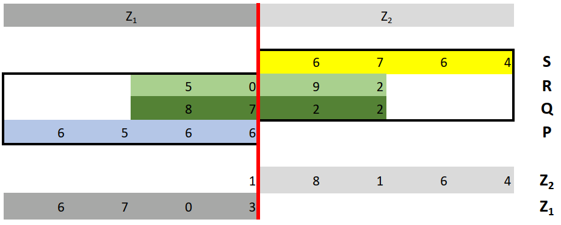

# Appendix A - `Float316` Functions in Detail

## Normalization of `Float316` Numbers

Ignoring the sign for a moment, our `Float316` number's real form is $m\cdot2^e$ (since we store the explicit 1 in $m$, we don't have to add it to $m$ anymore).

If we right-shift the bits of the mantissa, we actually halve the number, because new each mantissa bit contributes half as much to the real number. A mantissa that starts as `001110...` can be deciphered as

$$\mathbf{0} \cdot 4 + \mathbf{0} \cdot 2 + \mathbf{1} \cdot 1 + \mathbf{1} \cdot \frac{1}{2} + \mathbf{1} \cdot \frac{1}{4} + \mathbf{0} \cdot \frac{1}{8} + \dots = 0.75$$

After a bit-shift to the right, it becomes `000111...`, thus:

$$\mathbf{0} \cdot 4 + \mathbf{0} \cdot 2 + \mathbf{0} \cdot 1 + \mathbf{1} \cdot \frac{1}{2} + \mathbf{1} \cdot \frac{1}{4} + \mathbf{1} \cdot \frac{1}{8} + \dots = 0.375$$

With a right shift, we halved the value of the number. But we can also modify the exponent. Adding 1 to the exponent means we just simply double the number.

So, bit-shifting the mantissa to the right **and** adding 1 to the exponent actually represents the same number! Similarly, we can bit-shift the mantissa to the left and subtract 1 from the exponent. (Well, within certain boundaries, because too many bit shifts we can lose significant bits.) But now the mantissa does not start with `001` - it becomes **denormalized**.

Why does this matter? Because addition, multiplication, and a bunch of other operands must temporarily denormalize the number in order to do their magic. Also, the resulted number can be denormalized on its own. But now we know what to do: in order to **normalize a `Float316` number**, we just have to bit-shift the mantissa and change the exponent at the same time, until the mantissa starts with `001`. (We won't do this in the case of positive or negative zero where the mantissa is all $0$ bits.)

Note that in Jack we do not have bit shift operators. For bit-shifting the mantissa to the right, we actually have to halve its integer representation. Bit-shifting to the left is just adding it to itself.

Why do we need normalized numbers? Because it simplifies a lot of the arithmetic functions if we know that the starting numbers are already normalized.

In Jack, we can check if a number is normalized: the mantissa must start as `001...`, so it is always between $8192 \le m < 16384$.

## The `gt()` Function

Which `Float316` number is bigger? Well, positive numbers are bigger than negatives, so check the signs first. If both are positives, then the bigger exponent wins. If even the exponents are the same, the bigger mantissa wins. For negative numbers, the smaller exponent (after that, the smaller mantissa) wins.

That was easy, huh? Let's see something harder.

## Addition of `Float316` Numbers

Wikipedia has a handy article about [floating point arithmetic](https://en.wikipedia.org/wiki/Floating-point_arithmetic), so we only have to follow it!

The main steps are:
1. Let's call the number `Bigger` which is bigger in absolute terms (ignoring the sign bit), the other will be `Smaller`.
2. If `Smaller` represents a zero (exponent and mantissa are $0$), return with `Bigger` ($x + 0 = x$).
3. If `Bigger` and `Smaller` is the same but with different signs, return with `0.0` ($x + -x = 0$).
4. Denormalize `Smaller` until its exponent matches the the exponent of `Bigger`.
5. If the signs are the same, add the two mantissas. If the signs are different, subtract the `Smaller` mantissa from the `Bigger` mantissa (this never underflows by the way). This is the result mantissa.
6. The result has the same sign and exponent as `Bigger`.
7. Normalize the result.

Example: add `1, 129, 10752` ($-5.25$) and `0, 127, 12288` ($1.5$).

`Bigger`: `1, 129, 10752`, `Smaller`: `0, 127, 12288`.
Sign of result: $1$, exponent of result: $129$ (encodes $e=2$).
Denormalize `Smaller`: now it becomes `0, 129, 3072` (exponent increased by $2$, mantissa halved twice).
Signs are different: mantissa of the result is $10752 - 3072 = 7680$.
Resulted number is: `1, 129, 7680`.
After normalization: `1, 128, 15360` (exponent decreased by $1$, mantissa doubled).

Which happens to encode the real number $-3.75$.

##  Substraction of `Float316` Numbers

Change the sign of the second number and do addition. Duh!

##  Multiplication of `Float316` Numbers

This is gonna be a bumpy ride. At first glance it seems easy: to multiply $m_1 \cdot 2^{e_1}$ and $m_2 \cdot 2^{e_2}$, the result is simply $m_1 m_2 \cdot 2^{e_1 + e_2}$. We just have to add the mantissas and multiply the exponents!

The smaller caveat is that both exponents contain the extra bias of $127$. Adding them means we have double bias, so we have to subtract it once: the new exponent is $e_1 + e_2 - 127$.

The sign is also easy: $(s_1 + s_2) ~ \text{mod} ~ 2$. Or, since we don't have a `mod` function, $(s_1 + s_2) ~ \\& ~ 1$.

The biggest issue is multiplying the mantissas. Normally it would go like this: multiply the mantissas in 32 bit registers (since multiplying 16 bit numbers require at most 32 bits), and keep the top 16 bits as the truncated result. But we don't have 32 bits - so we have to break the multiplications into parts.

For the sake of an example, let's say we operate on decimal numbers, and can only store 4 digits in 6 digit registers (so we can detect overflow). The number $4123$ is stored as `0 0 4 1 2 3`.

We want to multiply $A = 9876$ and $B = 6789$. The result is a 8 digit number, and to store it we need two registers. Let's call them $M_1$ and $M_2$. Since the true result is $67048164$, we expect the following:

**Given $A =$ `0 0 9 8 7 6` and $B =$ `0 0 6 7 8 9`, we want $M_1 =$ `0 0 6 7 0 4` and $M_2 =$ `0 0 8 1 6 4`.**

First, we break $A$ and $B$ into two 2-digit parts, and store them in separate registers. Let's call $X_H$ = first two digits of a number stored in register $X$ (higher part), and $X_L$ = last two digits of the number in $X$ (lower part). Therefore, we have:

$A_H =$ `0 0 0 0 9 8`, $A_L =$ `0 0 0 0 7 6`, $B_H =$ `0 0 0 0 6 7`, $B_L =$ `0 0 0 0 8 9`.

Notice that $X = 100 X_H + X_L$ by design. Therefore, we can write the following identity:

$$A \cdot B = ( 100 A_H + A_L ) \cdot ( 100 B_H + B_L ) = $$

$$10000 \cdot A_H B_H + 100 \cdot (A_H B_L + A_L B_H) + A_L B_L.$$

We can calculate the four main parts in separate registers. The result never requires more than 4 digits, so we don't have to worry about overflow.

$A_H B_H = 98 \cdot 67 =$ `0 0 6 5 6 6`. Let's call this $P$.

$A_H B_L = 98 \cdot 89 =$ `0 0 8 7 2 2`. Let's call this $Q$.

$A_L B_H = 76 \cdot 67 =$ `0 0 5 0 9 2`. Let's call this $R$.

$A_L B_L = 76 \cdot 89 =$ `0 0 6 7 6 4`. Let's call this $S$.

By shifting them to the left ($P$ by 4 places, $Q$ and $R$ by 2 places, $S$ by none) and adding them together, we get the result. This table illustrates the process:

Breaking the addition into $M_1$ and $M_2$ registers:

$M_2 = S + 100 R_L + 100 Q_L = 6764 + 9200 + 2200 =$ `0 1 8 1 6 4`

$M_1 = R_H + Q_H + P = 50 + 87 + 6566 =$ `0 0 6 7 0 3`

Notice that in this example, $M_2$ register no longer starts with `0 0`: we have an overflow, which we want to bring from $M_2$ to $M_1$. Doing so, we get the final result:

$M_1 =$ `0 0 6 7 0 4`, $M_2 =$ `0 0 8 1 6 4`.

We want to do the same with our `Float316` mantissas. We have 16 digit registers with 14 significant binary digits, so we break them into 7 digit parts first, do our magic, and keeping the $M_1$ part as the new mantissa. We throw away the $M_2$ part as truncation.

**But what about the decimal point?**

Our mantissa contains a virtual binary point: `0011001(...)` actually means `001.1001(...)`. Let's look at our example again, but with a decimal point after the third digit (first significant digit): Let's interpret $A =$ `0 0 9 8 7 6` as $9.876$. Similarly, $B =$ `0 0 6 7 8 9` is $6.789$. After our calculations, $M_1$ register still contains `0 0 6 7 0 4`, since we do everything exactly the same way. But we cannot interpret the result as $6.704$! Instead, it should be $67.04$ (as the true value of $9.876 \cdot 6.789 = 67.048164$). The decimal point shifted by one. (Think about it why!) To fix it, we have to adjust the exponent by subtracting $1$.

One final note: in the actual implementation of the `Float316` multiplication, we drop every calculation that is related to $M_2$, since we don't use it anyway. We lose some precision though: as we saw in the example, an overflow in $M_2$ modifies the last digit/bit of $M_1$. But we can make this sacrifice in order to speed up the computation!

Finally, let's sum up the steps of the multiplication!

1. The result has the sign of $(s1 + s2) ~ \\& ~ 1$.
2. If one of the numbers is $0.0$, return with $0.0$.
3. If one of the numbers is $\pm 1.0$, return with the other number with the new sign.
4. The result has the exponent $e_1 + e_2 - 127 + 1$.
5. For the mantissa:
    1) If $X_H$ denotes the higher 7 bits ($X / 128$), and $X_L$ is the lower 7 bits ($X ~ \\& ~ 127$) of an integer $X$, then let:
    2) $P = m_{1H} \cdot m_{2H}$,
    3) $Q = m_{1H} \cdot m_{2L}$,
    4) $R = m_{1L} \cdot m_{2H}$.
    5) The final mantissa is $P + Q_H + R_H$.
6. Normalize the final number.

If you reached this point, congratulations! This was probably the hardest part. :-)

##  Division of `Float316` Numbers

This will be surprisingly easy after multiplication. Dividing $m_1 \cdot 2^{e_1}$ by $m_2 \cdot 2^{e_2}$ results $\frac{m_1}{m_2} \cdot 2^{e_1 - e_2}$.

Sign is simple: $(s_1 + s_2) ~ \& ~ 1$.

Exponent: $e_1 + 127 - e_2$.

Now, we cannot use integer division between the mantissas. If $A =$ `0 127 12288` ($1.5$) and $B =$ `0 123 13107` (approx. $0.1$), we expect $A/B$ to be around `0 130 15360` ($15.0$). But an integer division of the mantissas $12288$ and $13107$ gives us $0$.

Instead, what we'll do is repeated subtraction and bit shift. For the sake of an example, let's say we operate on decimals up to 3 decimal places, and we want to calculate $A/B$ where $A = 321.000$, and $B = 513.000$.

We subtract $B$ from $A$ $n$ times ($A - nB$) where $n$ is as big as possible as long as the result remains positive. We mark down $n$, replace $A$ with the subtracted value, and shift $B$ to the right. We repeat this as long as we can, or in our case: until we run out of digits of $B$.

$n = 0$, since $321.000 - 1 \cdot 513.000$ would be negative. $A$ does not change, $B$ shifts into $51.300$.

$n = 6$, since $321.000 - 7 \cdot 51.300$ would be negative. $A$ changes to $13.200$, $B$ shifts into $5.130$.

$n = 2$, since $13.200 - 3 \cdot 5.130$ would be negative. $A$ changes to $2.940$, $B$ shifts into $0.513$.

$n = 5$, since $2.940 - 6 \cdot 0.513$ would be negative. $A$ changes to $0.375$, $B$ shifts into $0.051$. We start to lose significant digits on $B$, so our result won't be accurate, but hopefully good enough. Still, we continue.

$n = 7$, since $0.375 - 8 \cdot 0.051$ would be negative. $A$ changes to $0.018$, $B$ shifts into  $0.005$.

$n = 3$, since $0.018 - n \cdot 0.005$ would be negative. $A$ changes to $0.003$, $B$ shifts into $0.000$.

$B$ ran out of significant digits, so we can stop (the next step would bring $n$ to infinity). Collecting the $n$ values, the result is $0.62573$. The true result of $A/B$ is $0.62573099415$, so it's quite close!

In binary we do the same with the mantissas, except we have an even easier job: $n$ is either $0$ or $1$, so a single comparison of $A$ and $B$ is enough to determine the result.

To sum up:
1. If the first number is $0.0$, return with $0.0$.
2. If the second number is $0.0$, **panic**.
3. The result has the sign of $(s1 + s2) ~ \& ~ 1$.
4. The result has the exponent $e_1 + 127 - e_2$.
5. For the mantissa $m$:
    i) Set the bit index to $i = 13$ (the first significant digit of $m$).
    ii) While $i \ge 0$, repeat the following steps:
    iii) if $m_1 > m_2$, then $m_1 = m_1 - m_2$ and let $m[i] = 1$.
    iv) Regardless of the previous step, divide $m_2$ by $2$ (right-shift), and lower the bit index $i$ by $1$.

##  Floor and Modulo 2 of `Float316` Numbers

They are fairly simple. If you set every bit from the $n$th position in the mantissa to $0$ (counting from the least significant bit being at position $0$), you will end up with an integer. And if you peek at the bit one position before $n$, you will know if it's even or odd. And what is the value of $n$? That depends on the exponent!

Go to [this handy tool](https://www.h-schmidt.net/FloatConverter/IEEE754.html) or any similar application that let you show IEEE 754 float numbers, and start to write in integers. Can you see the pattern? `Float316` works the same way, just don't forget that the mantissa is padded with `001`.

For the curious minds: the solution is $n = 22 - (e - 127)$ for IEEE 754, and $n = 12 - (e - 127)$ for `Float316` numbers.

Note that zeroing out the mantissa up to the $n$th position gives us the `floor` function for positive numbers, but `ceil` function for negatives. We have to adjust the result if we are dealing with negatives.

##  Square Root of `Float316` Numbers

Our general strategy: go with an initial guess, and use [Newton-Raphson method](https://en.wikipedia.org/wiki/Newton%27s_method) to get a better approximation. I don't want to go into the details why and how this method works, there are plenty of articles and examples on the subject.

For the square root function, we have:

$$x_{n+1} = \frac{\large(x_n + \frac{X}{x_n}\large)}{2}$$

where $X$ is the number we want the square root of, and $x_0$ is the initial guess: the closer to the square root the better, because we need fewer iterations for a good result. So what is a good initial guess?

`Float316` numbers are $m \cdot 2^e$, and taking the square root is equivalent of raising it to the $1/2$th power: 

$$(m \cdot 2^e)^{1/2} = m^{1/2} \cdot 2^{(e/2)}$$

So we need the square root of the mantissa, and halve the exponent.

To spare some computations, we won't bother with the mantissa, so we leave it as it is. The Newton-Raphson method will set it anyway.

To halve the exponent, we have to consider the bias: the new exponent should be $(e-127)/2 + 127 = e/2 + 63.5$. Since $e/2$ is an integer division, and we cannot subtract a fractional number, we go with $e/2 + 63$ if $e$ was originally even, and $e/2 + 64$ if $e$ was originally odd.

I found that two iterations of the Newton-Raphson method is sufficient for our raymarcher.

##  (Fast) Inverse Square Root of `Float316` Numbers

Computing $c/\sqrt{x}$ for some $c$ and $x$ values requires a square root function followed by a division (and as we will see later, we need this combination for vector normalization). Division is slower than multiplication - so wouldn't it be better if we could do $c \cdot \frac{1}{\sqrt{x}}$, where $\frac{1}{\sqrt{x}}$ is computed directly? The answer is yes!

Our main strategy is technically the same as the square root function: take an initial guess, and refine it with the [Newton-Raphson method](https://en.wikipedia.org/wiki/Newton%27s_method). Only this time we have a different function:

$$x_{n+1} = x_n \cdot (1.5 - (X/2 \cdot x_n^2))$$

Again, with $X$ being the number we want the inverse square root of. We need a good intitial guess for $x_0$.

The inverse square root of a value is just raising that value to the $-1/2$th power:

$$(m \cdot 2^e)^{-\frac{1}{2}} = m^{-\frac{1}{2}} \cdot 2^{-\frac{e}{2}}$$

Again, we leave the mantissa, and focus on only the exponent: $-(e - 127)/2 + 127 = 190.5 - e/2$. In the code, we just use $190 - e/2$ as the new exponent, and use two iterations of the Newton-Raphson method.

What is fascinating is that this algorithm is a simplified version of the famous [Fast Inverse Square Root](https://en.wikipedia.org/wiki/Fast_inverse_square_root) method, which heavily relies on how IEEE 754 stores a float number. I won't go into the details on how it works - and luckily, we don't actually need to understand it to use our version of the `Float316` implementation, but I still recommend to dig into that algorithm - it is mind blowing! And though it may not seems true first, but the two methods are actually closely related.[^1]

[^1]: Notice that the main step in the Fast Inverse Square Root algorithm is $\text{0x5f3759df} -  (  i  \text{>>}  1  )$: it halves the original number (interpreted as an integer), and subtract it from a magic constant. The decimal value of the constant is $1597463007$. What we did in our version is $190.5 - e/2$ for the exponent: we halved the exponent, and subtracted it from a "less-magical" constant. But what happens if we apply the same strategy to an IEEE 754 number? We need to bit-shift $190.5$ to the left to skip the mantissa: that means we apply $190.5 \cdot 2^{23} - i/2$. It does the same trick if we handle the entire bit string as an $i$ integer: the mantissa is halved, and subtracted from 190.5. It will change the mantissa too, but let's ignore that here. And guess what: $190.5 \cdot 2^{23} = 1598029824$. Quite close to the original mysterious magic constant! And it's not a coincidence. :-)

Another recommended reading on the simplified version can be found [here](https://githubharald.github.io/fast_inv_sqrt.html).

Side note: computing $c \cdot \text{invSqrt}(x)$ is only slightly better than $c / \text{sqrt}(x)$ on the Hack machine: I found the first to be only 23% faster. The reason is that both cases requires a lot of function calls and internal calculations; the Hack machine does not support float operations, so even a simple multiplication is quite slow, and makes the difference less significant. Still, even that 23% speed up is worth it, since we will use vector normalization a lot!
