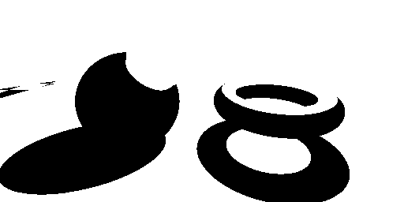
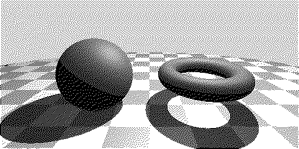
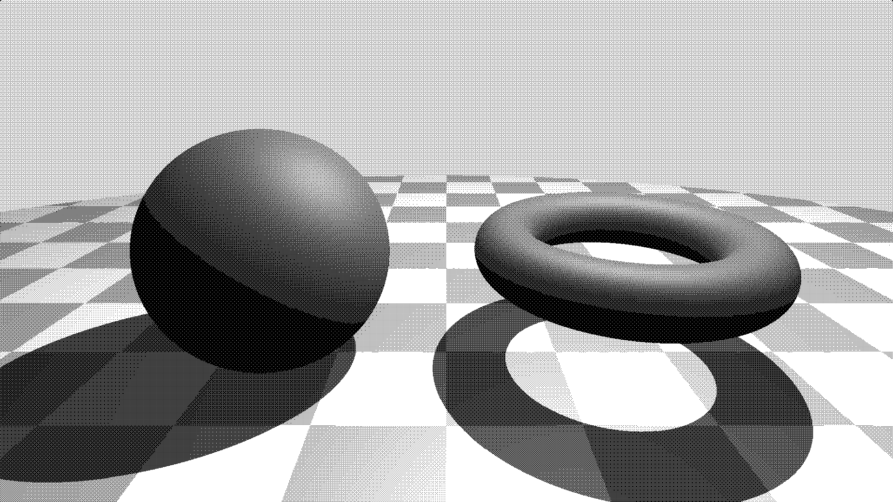
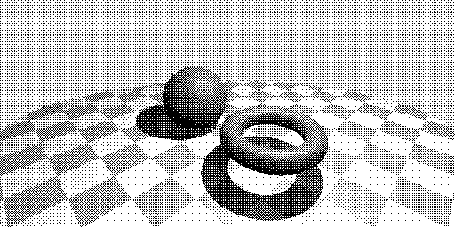
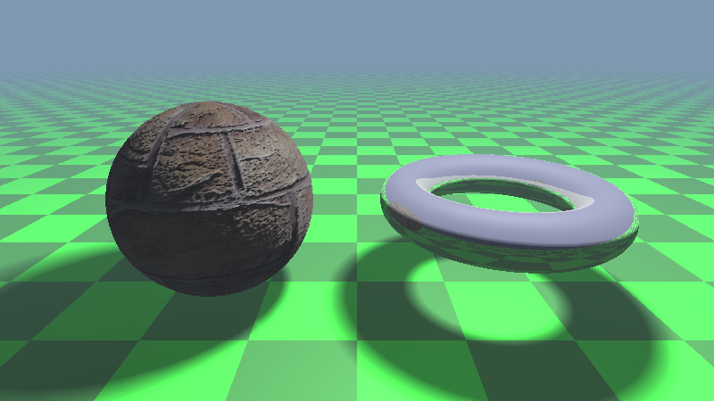
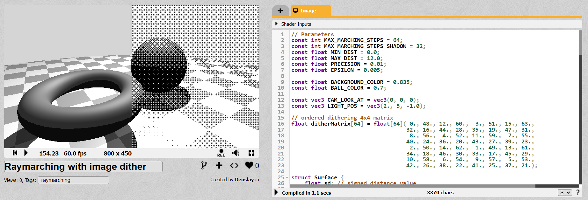

# Appendix B - Gallery

The grayscale prototype image created with Python, with built-in `float` numbers.

&nbsp;

&nbsp;

The simplest dither algorithm: threshold. Every pixel that has a grayscale value of $0.5$ or higher is white, the rest is black. This is why we need dithering.

&nbsp;

&nbsp;

Random dithering: instead of painting a pixel white if its grayscale value is high, we paint it white only *with certain probability*. Since the grayscale value is already between $0$ and $1$, that can be the probability value itself. So a white-ish (but not completely white) area will still contain some black pixels. A gray area should have white and black pixels in equal amount. The result is still far from satisfying - but it's a good effort.

&nbsp;

&nbsp;

[Floyd-Steinberg dithering](https://en.wikipedia.org/wiki/Floyd%E2%80%93Steinberg_dithering). For each pixel we apply a simple threshold, but then we push the difference (called *residual quantization error*) to its neighbours. A white-ish area will contain a lot of white pixels, until the error grows too large and a black pixel appear. The resulted image is very nice, but the algorithm requires to keep a lot of error values in memory, which I wanted to avoid in Jack/Hack. Alex Quach used this algorithm in his [Jack raytracer](https://blog.alexqua.ch/posts/from-nand-to-raytracer/).

&nbsp;

&nbsp;

The final image we produce, with an $8 \times 8$ ordered dithering.

&nbsp;

&nbsp;

The same image with ordered dithering, but with a resolution of $1920 \times 1080$. Open the image separately to see in its full glory!

&nbsp;

&nbsp;

Changing the camera position from $(0, 1.5, 4)$ to $(4, 3, 4)$. In the Python code, it means we swap `PARAM_cameraPos = Vec3(Float316(0, 0, 0), Float316(0, 127, 12288), Float316(0, 129, 8192))` with `PARAM_cameraPos = Vec3(Float316(0, 129, 8192), Float316(0, 128, 12288), Float316(0, 129, 8192))` in the `Parameters.py` file.

&nbsp;

&nbsp;

A step towards reality: colors, texture and [displacement mapping](https://en.wikipedia.org/wiki/Displacement_mapping) on the sphere, reflective surface on the torus, soft shadows, fog effect. Too bad it's above the Hack machine's paygrade! See https://www.shadertoy.com/view/csVyz1 in animation.

&nbsp;

&nbsp;

Animated version created by Shadertoy. Go to https://www.shadertoy.com/view/dtSyDz to see it in real time!
